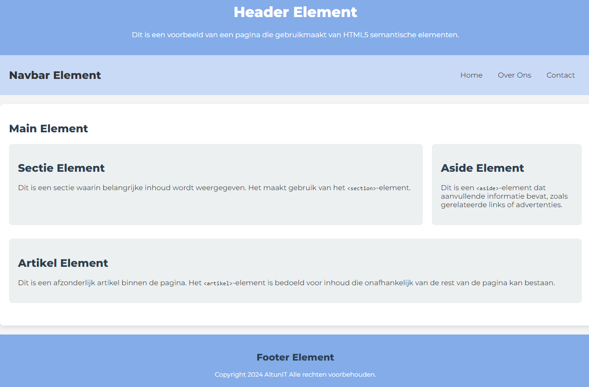

# AltunIT | Semantische Elementen Webpagina Uitwerkingen

# Voltooide Webpagina met Semantische Elementen

Deze webpagina is een voorbeeld van het gebruik van HTML5 semantische elementen. De focus ligt op het toepassen van semantische tags om de inhoud van de pagina op een overzichtelijke en toegankelijke manier te structureren. Hoewel CSS nog niet is behandeld in deze oefening, is er alvast een link naar een style.css-bestand toegevoegd voor toekomstige styling, die in het volgende hoofdstuk aan bod komt.

## Inhoud

- Header: Voor de titel en een introductie van de pagina.
- Nav: Voor de navigatielinks naar verschillende delen van de pagina.
- Main: Voor de kerninhoud van de pagina.
- Section: Om inhoud in logische secties te groeperen.
- Aside: Voor aanvullende informatie, zoals gerelateerde links.
- Article: Voor onafhankelijke stukken inhoud zoals artikelen of blogposts.
- Footer: Voor informatie aan het einde van de pagina, zoals contactgegevens of copyright.

### Opmerking over CSS

Hoewel er een link naar een style.css-bestand is toegevoegd aan de HTML, behandelen we de CSS-styling pas in het volgende hoofdstuk. De focus van deze oefening ligt op het correct gebruiken van semantische HTML-elementen. In een later hoofdstuk zul je leren hoe je de pagina kunt stylen met CSS om een nette layout en opmaak te creëren.

Voor nu hoef je niets met CSS te doen, maar je kunt wel alvast de structuur van de HTML verkennen en begrijpen hoe de semantische elementen werken.

## Eindresultaat

Hieronder zie je een voorbeeld van de webpagina die is opgebouwd met HTML5 semantische elementen. 

